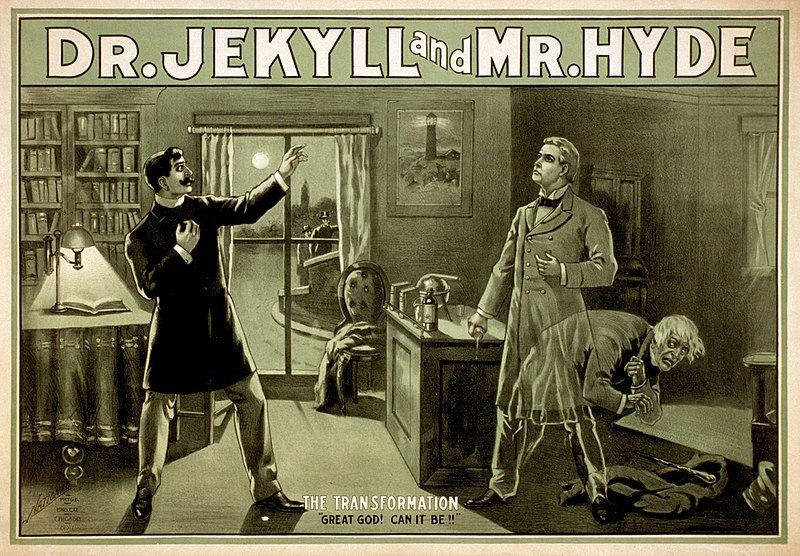

Presenting a journey into creating OER (Open Educational Resources)...

- ...building them on a service where anyone can see the resource and
  its source code...
- ...and anyone can copy a resource, make their own version, and contribute
  changes back...
- ...making them truly open educational resources - easy for all to share
  and adapt!

<figure>
  
  <figcaption>
    Poster for a theatrical adaptation of <i>Strange Case of Dr Jekyll and Mr Hyde</i> 
    <a href="https://creativecommons.org/licenses/by-sa/3.0/">CC-BY-SA</a>
    <a href="https://commons.wikimedia.org/wiki/File:Dr_Jekyll_and_Mr_Hyde_poster_edit2.jpg">Wikimedia Commons</a>
  </figcaption>
</figure>
